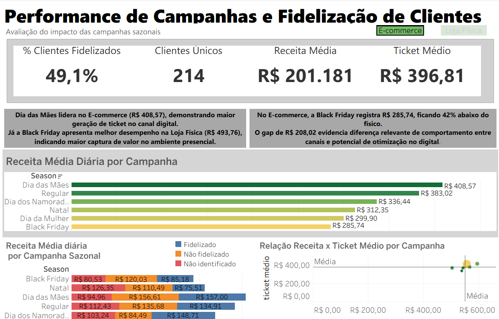

## 📊 Master Plan — Performance de Varejo & Comunicação
Diagnóstico de Campanhas, KPIs e Portfólio | SQL • Python • Tableau

Este projeto simula um ecossistema analítico completo do setor de varejo de beleza e venda direta, com foco em performance comercial, CRM e impacto de comunicações sazonais.

O objetivo é demonstrar domínio técnico em Engenharia e Análise de Dados, aliado a uma visão estratégica de negócio, conectando:

Estruturação e modelagem de dados (SQL Avançado)

Automação e tratamento de dados (Python)

Aplicação de hipóteses de negócio e validações estatísticas

Storytelling executivo orientado à tomada de decisão

## 🚀 Visualização do Dashboard
Explore os principais KPIs de Performance, CRM e Portfólio no dashboard interativo.

🔗 **[Acesse o Dashboard Interativo no Tableau Public](https://public.tableau.com/views/VisoGeraldePerformance/Capa?:language=pt-BR&:sid=&:redirect=auth&:display_count=n&:origin=viz_share_link)**

---

## 🏗️ Arquitetura de Dados

O pipeline foi estruturado seguindo o conceito de Multi-hop Architecture (RAW → TRUSTED → GOLD), garantindo rastreabilidade, governança e confiabilidade analítica.

🔄 Processo ETL & Modelagem

1️⃣ RAW — Camada de Dados Brutos
Armazena dados sintéticos simulando sistemas transacionais (PDV e e-commerce), preservando a integridade original para auditoria.

2️⃣ STAGING / TRUSTED — Camada Tratada
Transformações realizadas via Python (Pandas):

Padronização de textos

Tratamento de valores nulos

Conversão de tipos numéricos

Validação de métricas financeiras

Remoção de inconsistências

3️⃣ GOLD — Camada Analítica
Consolidação das dimensões e fato em uma tabela denormalizada:

sales_complete_clean

## 🎯 Diferencial Técnico

A decisão por uma tabela Gold denormalizada foi estratégica:

Redução de custo computacional no Tableau

Eliminação de joins em tempo de visualização

Métricas financeiras pré-calculadas

Ganho de performance e escalabilidade analítica

Essa abordagem simula o padrão utilizado em ambientes corporativos com foco em BI de alta performance.

## 💾 Engenharia de Dados com SQL

A camada analítica foi construída com foco em:

Integridade referencial

Padronização de dados financeiros

Validação de hipóteses de negócio

Reprodutibilidade do pipeline

## 🏗️ Estrutura de Scripts

📁 01_setup_stg.sql

Criação das tabelas

Implementação de Primary Keys / Foreign Keys

Tipos DECIMAL(12,2) para precisão financeira

📁 02_data_cleaning_analytics.sql

Transformações SQL

Uso de REGEXP_REPLACE para limpeza

Criação da tabela Gold consolidada

📁 03_business_hypotheses.sql

Validação de 10+ hipóteses estratégicas

Uso de CTEs

Aplicação de Window Functions

Curva ABC de produtos

Análises de CRM e fidelização

## 📊 Principais KPIs & Insights Estratégicos
💎 1. Gestão de CRM

Insight:
Clientes "Não Identificados" representam 32,3% da receita total.

Interpretação Estratégica:
Existe uma oportunidade clara de expansão de LTV por meio de melhoria na captura de dados no PDV e estratégias de conversão para programas de fidelidade.

🌸 2. Sazonalidade & Comunicação

Insight:

Dia das Mães lidera em volume de vendas.

Dia dos Namorados apresenta maior ticket médio (R$ 608,36).

Interpretação Estratégica:
Clientes sazonais possuem alto potencial de gasto, sendo ideais para:

Testes A/B de fluxos personalizados

Campanhas de “Gift-Giving”

Estratégias de reativação em datas secundárias

🧴 3. Portfólio & Margem

Insight:
Skincare representa 36,8% da receita, com melhor margem média.

Interpretação Estratégica:
Categoria prioritária para:

Modelos de recorrência

Programas de reposição automática

Estratégias de fidelização baseadas em hábito

## 🧠 Conceitos Aplicados

Modelagem Dimensional (Star Schema)

Multi-hop Data Architecture

Curva ABC

Análise de Retenção

LTV (conceitual)

Experimentação (Testes A/B simulados)

Storytelling Executivo

Governança e padronização de métricas

## 🛠️ Tecnologias Utilizadas
Tecnologia	Aplicação
SQL Avançado	Modelagem, CTEs, Window Functions, Regex, Denormalização
Python (Pandas)	ETL, limpeza, padronização e automações
Tableau	Dashboards executivos e Data Storytelling
Markdown	Documentação técnica e governança
🎯 Competências Demonstradas

✔ Estruturação de dados a partir de múltiplas fontes
✔ Criação de tabelas analíticas para dashboards executivos
✔ Automação de processos de tratamento de dados
✔ Validação de hipóteses de negócio via SQL
✔ Construção de materiais executivos orientados à liderança
✔ Diagnóstico de KPIs e direcionamento estratégico
✔ Interface entre áreas (CRM, Marketing, Comercial e Produto)
---

## 👨‍💻 Autor
**Victor Biscaia**
* 
* 

---
*Projeto desenvolvido com visão estratégica voltada para desafios reais de performance no varejo de beleza.*
