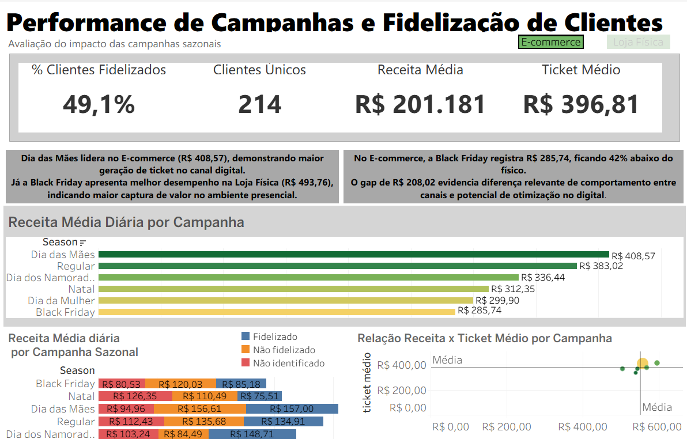

📊 Análise Comercial, CRM e Impacto de Campanhas Sazonais

Projeto de Data Analytics com foco em performance comercial, comportamento de consumo e impacto de campanhas sazonais, integrando análise de ticket médio, categorias estratégicas e oportunidades de CRM.

🎯 Objetivo do Projeto

Identificar padrões de compra, comportamento por canal e oportunidades estratégicas para:

Aumentar Ticket Médio

Melhorar conversão em datas sazonais

Otimizar estratégias de CRM

Direcionar investimentos em marketing

Identificar categorias de maior impacto na receita

## 🚀 Visualização do Dashboard
Explore os principais KPIs de Performance, CRM e Portfólio no dashboard interativo.

🔗 **[Acesse o Dashboard Interativo no Tableau Public](https://public.tableau.com/views/VisoGeraldePerformance/Capa?:language=pt-BR&:sid=&:redirect=auth&:display_count=n&:origin=viz_share_link)**

🧩 Metodologia

O projeto foi estruturado em quatro etapas principais:

1️⃣ Tratamento e Preparação de Dados

Normalização de nomes e categorias

Aplicação de regras de negócio

Tratamento de valores nulos e inconsistências

Criação de métricas estratégicas

2️⃣ Modelagem e Análise

Análise de ticket médio por canal e data

Segmentação de clientes

Análise de concentração de receita por categoria

Interpretação comportamental de consumo

3️⃣ Análise de Performance por Canal

Comparativo E-commerce vs Loja Física

Identificação de padrões sazonais

Avaliação de intenção de compra

4️⃣ Geração de Insights Estratégicos

Recomendações comerciais

Sugestões de testes A/B

Estratégias de reativação via CRM

👥 Análise da Base de Clientes

Clientes não fidelizados representam 34,9% da base ativa.

🔎 Implicações Estratégicas

Alta oportunidade de retenção

Potencial aumento de LTV

Espaço para campanhas de reengajamento

Redução de dependência de aquisição paga

🌹 Performance Sazonal — Datas Estratégicas
🎯 Ticket Médio por Data
🛍️ E-commerce

Dia das Mães: R$ 595,34 (maior ticket médio diário)

Black Friday: R$ 539,72 (5ª maior data em ticket médio)

🏬 Loja Física

Black Friday: R$ 621,78 (maior ticket médio)

Dia das Mães: R$ 582,35 (segunda maior)

🎄 Natal

Apresenta estabilidade de ticket médio entre os canais, indicando comportamento de compra consistente e previsível.

🧠 Interpretação Estratégica
📌 Dia das Mães

Forte indicador de intenção de compra qualificada, especialmente no e-commerce.
Alta propensão ao aumento de ticket via kits e produtos premium.

📌 Black Friday

Maior impacto na loja física, sugerindo comportamento orientado à experiência presencial e compras de oportunidade.

📌 Natal

Comportamento omnichannel equilibrado — oportunidade para campanhas integradas.

🎁 Conceito Estratégico: Gift-Giving

Datas como Dia das Mães e Natal seguem o padrão de Gift-Giving, caracterizado por:

Maior disposição a pagar

Menor sensibilidade a preço

Busca por kits e embalagens especiais

Compra emocional

🎯 Estratégias recomendadas

Kits exclusivos premium

Upsell orientado por perfil

Segmentação por tipo de presenteador

Personalização via CRM

🧪 Estratégia de Testes A/B

Para maximizar conversão e ticket médio:

1️⃣ Bundle vs Produto Unitário

Comparar performance de kits com leve incentivo de preço vs itens individuais.

Métricas:
Ticket médio | Conversão | Margem líquida

2️⃣ Comunicação Emocional vs Funcional

Teste de abordagem de campanha:

Grupo A: Mensagem emocional (presente, carinho, experiência)

Grupo B: Benefício técnico (ingredientes, performance, durabilidade)

Métricas:
CTR | Receita por usuário | Conversão

3️⃣ Incentivo Comercial

Comparação entre:

Desconto direto

Frete grátis

Brinde exclusivo

🔄 Estratégia de Reativação — Foco no E-commerce

Considerando 34,9% de clientes não fidelizados:

📌 Recomendação

Implementar estratégia de reengajamento antes da Black Friday com:

Mensageria automatizada (WhatsApp, SMS, E-mail via CRM)

Oferta antecipada exclusiva

Gatilhos de escassez controlada

Segmentação por histórico de compra

🎯 Objetivo

Aumentar conversão no canal online

Reduzir dependência de trááfego frio

Melhorar ROI de mídia paga

💄 Performance por Categoria — Skincare

Em 2025:

Skincare representa 44,3% da receita total

Produtos Classe A representam 58,9% da receita da categoria

🔎 Interpretação

Forte concentração em produtos premium

Indício de posicionamento aspiracional

Potencial de análise de elasticidade de preço

Oportunidade de cross-sell e recorrência

📈 Recomendações Estratégicas

Intensificar campanhas premium em datas de Gift-Giving

Estruturar plano de fidelização para reduzir base não fidelizada

Aumentar ticket médio no e-commerce na Black Friday

Explorar modelo omnichannel no Natal

Realizar análise aprofundada de margem e recorrência em Skincare

🛠️ Stack Utilizada

Python (ETL e tratamento de dados)

SQL (análises e consultas estratégicas)

Power BI (visualização e storytelling de dados)

Modelagem analítica orientada a negócio

🚀 Conclusão

O projeto demonstra como dados podem ser transformados em direcionamento estratégico real, apoiando decisões de:

Marketing

CRM

Precificação

Mix de produto

Planejamento sazonal

Mais do que visualizar números, o foco foi gerar insights acionáveis com impacto comercial direto.##

## 👨‍💻 Autor
**Victor Biscaia**
* 
* 

---
*Projeto desenvolvido com visão estratégica voltada para desafios reais de performance no varejo de beleza.*
